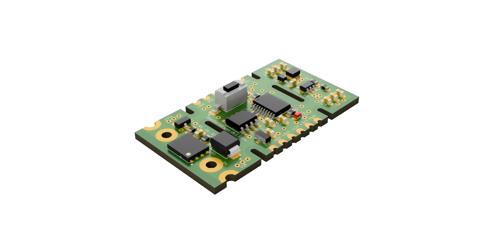

# OpenPAYGO Link

## What is OpenPAYGO Link?

OpenPAYGO Link (OPLink) is an open-source communication protocol for interfacing Solar Home Systems (SHS) with appliances and accessories. It allows you to easily make your SHS and appliances communicate with each other for features such as PAYGO locking of appliances, load-scheding, monitoring, etc. It includes both the hardware and software components needed to achieve communication from one SHS to multiple appliances over a single wire. 

## Key Features

* Very small footprint, can run on very restricted devices (e.g. STM8 with 1kB RAM and 8kB Flash)
* Half-duplex communication over a single wire with a multi-drop connection topology 
* Ensures reliable data transmission, even with different ground potentials between nodes 
* Supports variable-length payload 
* Supports standard request/reply and broadcast (to send requests to all appliances at once)
* The SHS (master) can automatically discover new appliances (slaves) and assign them a local address
* Slave nodes can instantly detect that they have been disconnected
* Slave nodes can directly send messages to the master (no need for polling from the master) 

It was designed to be used with Nexus Channel Core (based on the Open Connectivity Foundation communication standard) that provides standard resource model for common use cases. However, it is flexible enough that it can  be used with other application layers. 

**Limitations:**

There are a few limitations that are the result of compromises to keep the system as lightweight as possible. 

* The system is not intended to transmit large amount of data
* A node can only handle one request at a time
* The system can be slow if there are a lot of slaves on the bus
* The master needs to poll the appliances to detect that they have been disconnected

## Getting Started

This repository has resources to help you get started with adding OpenPAYGO Link to your SHS and/or appliance. There are a few options depending on your stage of development: 

**1. The STM8-based development board:** this small PCB includes the hardware required for OpenPAYGO Link (MCU + transceiver) as well as a buck converter to supply power from the power line, a switch controlled by the MCU, a push-button and an LED to facilitate testing. It is provided with an example firmware to get you started quickly (see ["Examples"](Examples/)). You can just drop the dev board into a prototype to have it control the switch in an appliance. 

**2. The STM8-based addon board:** this small PCB includes the bare minimum required for OpenPAYGO Link. You can add this addon board to an existing PCB as a way to quickly add OpenPAYGO Link to your system while not making any changes to the main MCU of your system. The addon board communicates with your main MCU through a simple GPIO to make it as easy as possible to use as all of the OpenPAYGO Link system is handled by the addon board. It is also provided with an example firmware (see ["Examples"](Examples/)). 

**3. Adapt the library for your main MCU:** This is the most cost efficient method as it does not require a secondary MCU just for OpenPAYGO Link. However, it requires more engineering as you need to develop some hardware abstractions to allow the OpenPAYGO Link library to use your device (see ["OPL"](OPL/)). This also requires your MCU to be compatible with 9-bit multiprocessor UART, which is very common but some MCU might not be supported. We keep a list of some MCUs known to be compatible with OpenPAYGO Link [here](Documentation/compatible_mcus.md). 

*OpenPAYGO Link STM8 Development Board*

## What's next? 

As the core of the features are implemented, we will focus our future efforts in adding more examples to help make it easier to adopt OpenPAYGO Link even for more complex use cases. In particular, we will focus on adding an example development board and addon board based on STM32 that will showcase more advanced use cases with more Nexus Channel Core endpoints and provide a basis to start more complex projects. 

We are welcoming external contribution to the projects, and we would be very happy to accept pull requests for implementation on any other MCU targets to make it easier for people to add OpenPAYGO Link to their main MCU as quickly as possible. 

You can track all of the new features and changes to the project in the [Changelog](CHANGELOG.md). 
